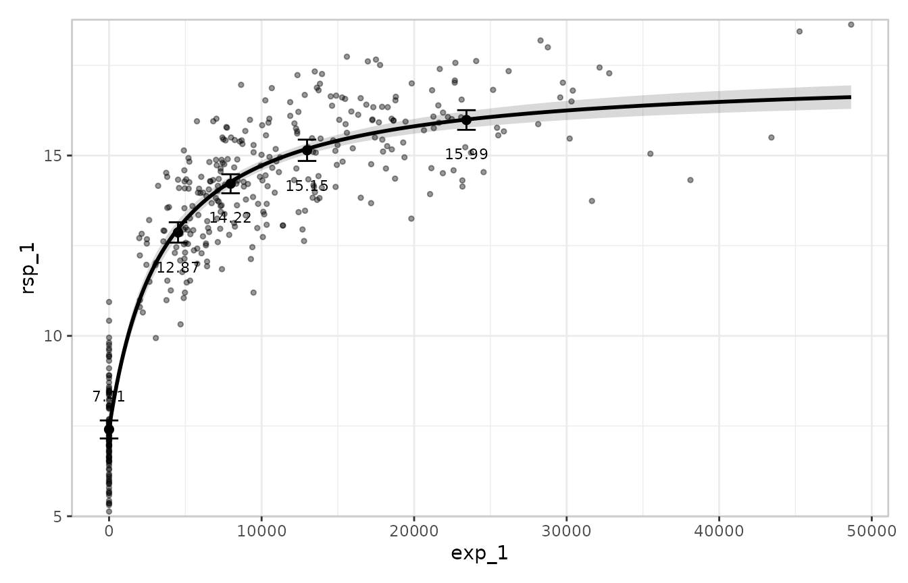
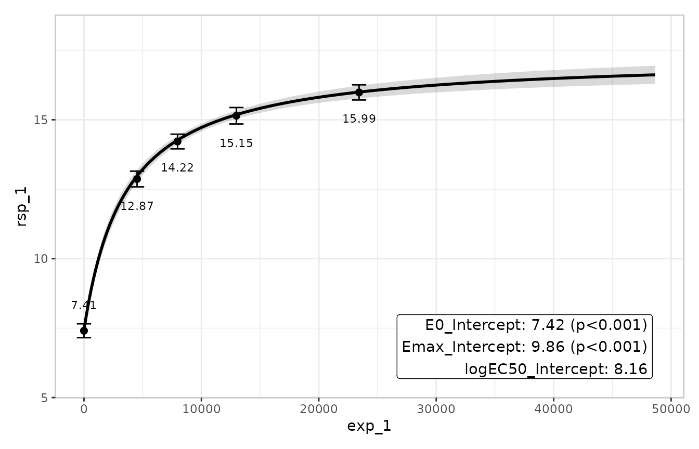
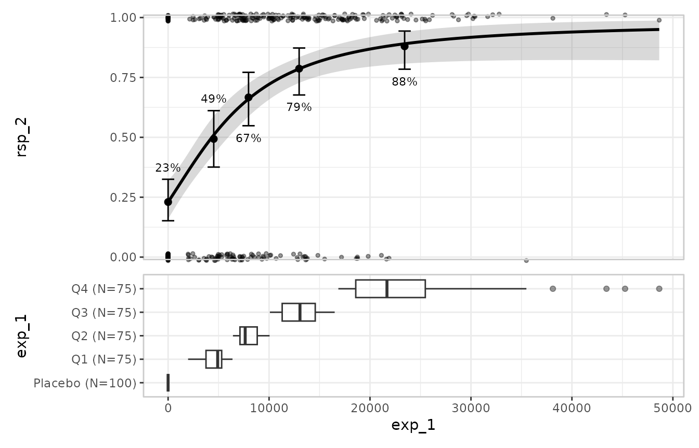
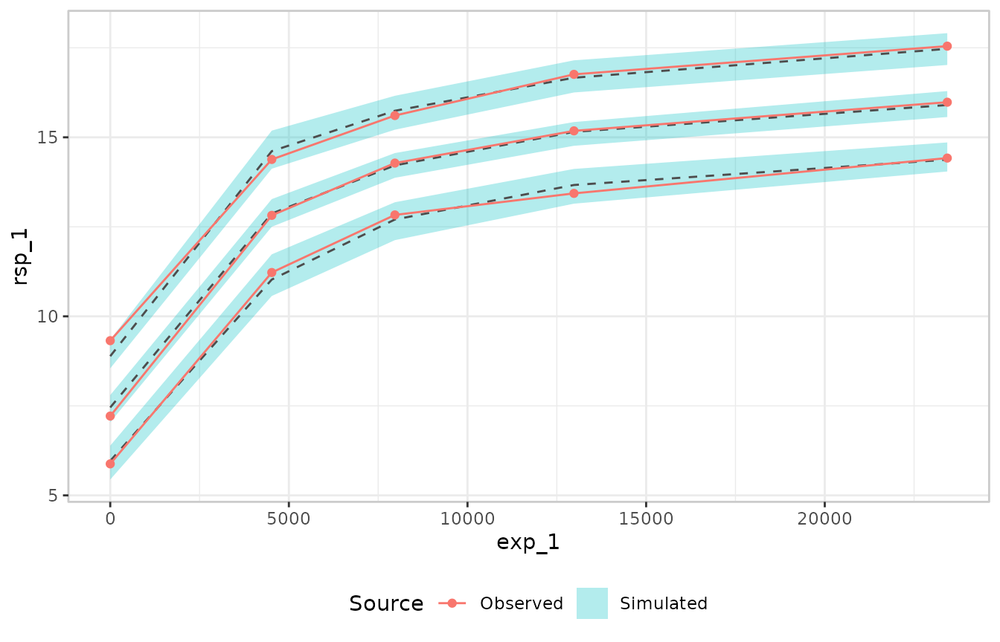
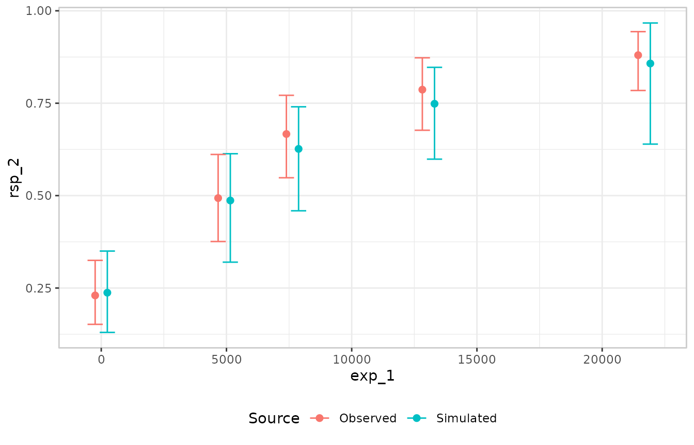

# Visualising exposure-response models with erplots

``` r

library(emaxnls)
library(erplots)
set.seed(2417)
```

The [erplots](https://erplots.djnavarro.net/) package provides a
mini-language for building publication-ready exposure-response plots and
visual predictive checks. It is model-agnostic: any package that
implements three generics —
[`er_predict()`](https://erplots.djnavarro.net/reference/er_model_interface.html),
[`er_simulate()`](https://erplots.djnavarro.net/reference/er_model_interface.html),
and
[`er_summary()`](https://erplots.djnavarro.net/reference/er_model_interface.html)
— can drive the plot pipeline. emaxnls registers methods for both
`emaxnls` and `emaxlogistic` objects. They are picked up automatically
when erplots is loaded, so no extra configuration is needed beyond
[`library(erplots)`](https://github.com/djnavarro/erplots).

This article assumes familiarity with
[`emax_nls()`](https://emaxnls.djnavarro.net/reference/emax_nls.md) and
[`emax_logistic()`](https://emaxnls.djnavarro.net/reference/emax_logistic.md);
if you are new to those, start with the
[continuous](https://emaxnls.djnavarro.net/articles/fitting-emax-models.md)
and
[binary](https://emaxnls.djnavarro.net/articles/fitting-logistic-emax-models.md)
model-fitting articles. For a complete treatment of what erplots can do
— theming, custom style builders, the full option surface of each layer
function — see the [erplots
documentation](https://erplots.djnavarro.net/).

## Exposure-response plots for continuous models

We start by fitting a simple
[`emax_nls()`](https://emaxnls.djnavarro.net/reference/emax_nls.md)
model on the bundled `emax_df` dataset:

``` r

mod <- emax_nls(
  structural_model = rsp_1 ~ exp_1,
  covariate_model  = list(E0 ~ 1, Emax ~ 1, logEC50 ~ 1),
  data             = emax_df
)
```

The erplots pipeline opens with
[`er_plot()`](https://erplots.djnavarro.net/reference/er_plot.html),
which declares the dataset and the exposure and response variables.
Layers are added with `er_plot_add_*()` calls, and the plot is drawn by
calling [`plot()`](https://rdrr.io/r/graphics/plot.default.html):

``` r

emax_df |>
  er_plot(exp_1, rsp_1) |>
  er_plot_add_model(mod) |>
  er_plot_add_quantiles() |>
  er_plot_add_data() |>
  plot()
```



The three layers here are:

- **Model layer**
  ([`er_plot_add_model()`](https://erplots.djnavarro.net/reference/er_plot_add_model.html)):
  a credible band for the Emax curve, built by sampling many parameter
  vectors from the estimated covariance matrix and evaluating the model
  at each draw.
- **Quantile layer**
  ([`er_plot_add_quantiles()`](https://erplots.djnavarro.net/reference/er_plot_add_quantiles.html)):
  the observed data binned by exposure quantile, with the mean and a
  confidence interval shown per bin.
- **Data layer**
  ([`er_plot_add_data()`](https://erplots.djnavarro.net/reference/er_plot_add_data.html)):
  the raw observations at their actual exposure-response coordinates.

### The summary layer

[`er_plot_add_summary()`](https://erplots.djnavarro.net/reference/er_plot_add_summary.html)
annotates the plot with a model summary. For most model types the
default style headlines the p-value for the primary drug-effect term.
Emax models have no single privileged coefficient for that role, so the
right style here is `er_style_summary_coefficients`, which instead shows
one line per structural parameter:

``` r

emax_df |>
  er_plot(exp_1, rsp_1) |>
  er_plot_add_model(mod) |>
  er_plot_add_summary(model = mod, style = er_style_summary_coefficients) |>
  er_plot_add_quantiles() |>
  plot()
```



### Stratification

Passing a discrete variable to `stratify_by` adds colour across all
layers, letting you inspect whether the model’s predictions track the
observed data separately within each level of that variable. A model
that includes the stratification variable as a covariate will produce
distinct prediction bands per stratum; a model that omits it will
produce the same band for all strata (which is itself informative — it
means the model is not accounting for that grouping). The [erplots
binary responses
article](https://erplots.djnavarro.net/articles/plot-binary.html) has a
full worked stratification example including how to suppress
stratification for individual layers with `keep_strata = FALSE`.

## Exposure-response plots for binary models

The pipeline works identically for `emaxlogistic` objects. The
`emaxlogistic` class inherits its
[`er_predict()`](https://erplots.djnavarro.net/reference/er_model_interface.html),
[`er_simulate()`](https://erplots.djnavarro.net/reference/er_model_interface.html),
and
[`er_summary()`](https://erplots.djnavarro.net/reference/er_model_interface.html)
methods from `emaxnls` via S3 inheritance, with internal branches to
keep predictions on the probability scale and to report `r_squared = NA`
in the summary layer where it would be meaningless. From the calling
code there is nothing extra to do:

``` r

mod_b <- emax_logistic(
  structural_model = rsp_2 ~ exp_1,
  covariate_model  = list(E0 ~ 1, Emax ~ 1, logEC50 ~ 1),
  data             = emax_df
)

emax_df |>
  er_plot(exp_1, rsp_2) |>
  er_plot_add_model(mod_b) |>
  er_plot_add_quantiles() |>
  er_plot_add_data() |>
  er_plot_add_groups(group_by = exp_1) |>
  plot()
```



[`er_plot()`](https://erplots.djnavarro.net/reference/er_plot.html)
auto-detects the binary response from the values of `rsp_2` (all in
$`\{0, 1\}`$) and automatically switches to Clopper-Pearson confidence
intervals for the quantile layer and a jitter-style display for the data
layer.

[`er_plot_add_groups()`](https://erplots.djnavarro.net/reference/er_plot_add_groups.html)
introduces the **group layer**, which is structurally distinct from the
other layers. Rather than overlaying content within the main panel, it
appends a separate panel below the plot showing the marginal
distribution of the exposure variable. Unlike the model, summary,
quantile, and data layers — which are singletons, so a second call
replaces the first — the group layer is *additive*: each
[`er_plot_add_groups()`](https://erplots.djnavarro.net/reference/er_plot_add_groups.html)
call adds one new panel, and you can stack several to display different
groupings. This makes it easy to see where observations are concentrated
along the exposure axis and to judge whether the quantile bins are
adequately covering the data.

## Visual predictive checks

A **visual predictive check** (VPC) compares what a model predicts
against what was actually observed, bin by bin across the exposure
range, making systematic misfit easy to see. The
[`er_vpc()`](https://erplots.djnavarro.net/reference/er_vpc.html)
mini-language generates VPCs from the same
[`er_predict()`](https://erplots.djnavarro.net/reference/er_model_interface.html)
and
[`er_simulate()`](https://erplots.djnavarro.net/reference/er_model_interface.html)
generics.

For a continuous response, the most informative presentation compares
observed and simulated *quantile distributions* rather than just means.
Connected lines trace the observed percentiles and shaded ribbons show
the corresponding simulated percentile ranges:

``` r

emax_df |>
  er_vpc(exposure = exp_1, response = rsp_1, response_type = "continuous") |>
  er_vpc_add_observed(style = er_style_vpc_observed_quantile_line) |>
  er_vpc_add_simulated(
    model = mod,
    seed  = 7438,
    style = er_style_vpc_simulated_quantile_ribbon
  ) |>
  plot()
```



The lines show the 10th, 50th, and 90th percentiles of the observed data
in each exposure bin; the ribbons show the same percentiles from the
simulated replicates. A well-fitting model will have its ribbons closely
enclosing the observed lines; systematic departures — ribbons
consistently above or below the lines — suggest that the model is
misspecified in some way.

The VPC works the same way for binary models.
[`er_plot()`](https://erplots.djnavarro.net/reference/er_plot.html)
auto-detects the response type, so passing `mod_b` (the `emaxlogistic`
object fitted above) to
[`er_vpc_add_simulated()`](https://erplots.djnavarro.net/reference/er_vpc_add_simulated.html)
is sufficient:

``` r

emax_df |>
  er_vpc(exposure = exp_1, response = rsp_2) |>
  er_vpc_add_observed(dodge = -0.005, errorbar_width = 0.0125) |>
  er_vpc_add_simulated(model = mod_b, seed = 7438,
                       dodge = 0.005, errorbar_width = 0.0125) |>
  plot()
```



For a binary response the default style — mean response rate with a
Clopper-Pearson interval, for both the observed and simulated layers —
is generally the most appropriate choice, so no custom style functions
are needed.

## Where to go next

The erplots documentation covers the full feature set in detail:

- [Plotting continuous
  responses](https://erplots.djnavarro.net/articles/plot-continuous.html)
  — the complete model-layer and quantile-layer options, data overlays,
  and group panels.
- [Plotting binary
  responses](https://erplots.djnavarro.net/articles/plot-binary.html) —
  binary-specific display options, the box-jitter data layer, and
  stratification.
- [Visual predictive
  checks](https://erplots.djnavarro.net/articles/plot-vpc.html) — VPCs
  by continuous or discrete covariate, stratified panels, and
  troubleshooting plot legibility.
- [Theming erplots](https://erplots.djnavarro.net/articles/theming.html)
  — axis labels, colour palettes, and the underlying ggplot2 theme.
