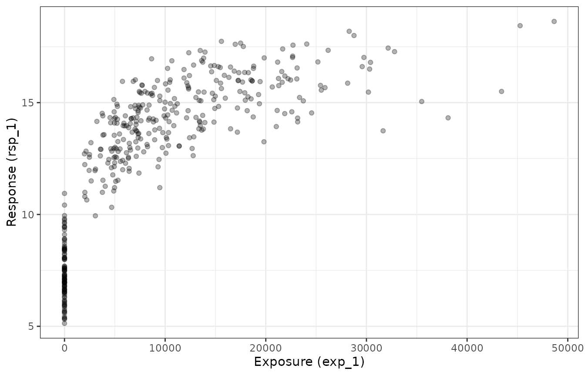
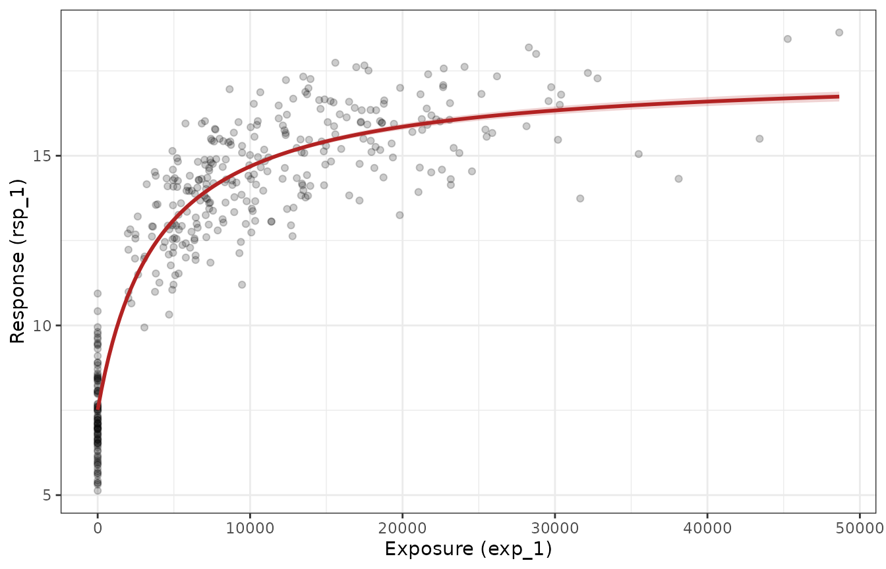

# Fitting Emax models for continuous outcomes

``` r

library(emaxnls)
library(tibble)
library(ggplot2)
theme_set(theme_bw())
set.seed(123)
```

This article walks through the process of fitting an Emax regression
model to a **continuous** outcome with
[`emax_nls()`](https://emaxnls.djnavarro.net/reference/emax_nls.md). It
describes the model that is being fitted, sets out the estimation
problem that
[`emax_nls()`](https://emaxnls.djnavarro.net/reference/emax_nls.md)
solves under the hood, and then works through how to read and interpret
the outputs. Binary outcomes follow a slightly different logic — they
are fitted with
[`emax_logistic()`](https://emaxnls.djnavarro.net/reference/emax_logistic.md)
on the logit scale using iterative reweighted least squares — and are
covered in a separate article.

## The Emax model

The Emax model is a widely used exposure-response model in
pharmacometrics. It describes a smooth, saturating relationship between
a measure of drug *exposure* (a dose, a concentration, an AUC) and a
*response*. As exposure increases the response moves away from a
baseline value and asymptotes towards a maximal effect. The appeal of
the model is that its parameters have direct pharmacological meaning.

### The hyperbolic Emax function

In its basic (hyperbolic) form, the expected response $`y`$ at exposure
$`x`$ is

``` math
y = E_0 + E_{\max}\,\frac{x}{x + EC_{50}}.
```

The three structural parameters are:

- **$`E_0`$** — the *baseline* response, i.e. the expected response at
  zero exposure ($`x = 0`$). This is the placebo or pre-treatment level.
- **$`E_{\max}`$** — the *maximal effect*, the largest change from
  baseline that the drug can produce. As $`x \to \infty`$ the response
  approaches $`E_0 + E_{\max}`$.
- **$`EC_{50}`$** — the exposure that produces *half* of the maximal
  effect. When $`x = EC_{50}`$ the term $`x / (x + EC_{50}) = 1/2`$, so
  the response is exactly halfway between $`E_0`$ and
  $`E_0 + E_{\max}`$. It is a measure of potency: a smaller $`EC_{50}`$
  means the drug reaches its effect at lower exposures.

Because $`EC_{50}`$ is a strictly positive quantity that often spans
several orders of magnitude, the package estimates it on the log scale.
Internally the model works with $`\log EC_{50}`$, which keeps the
parameter unconstrained and tends to make the optimisation better
behaved. This is why the parameter is named `logEC50` throughout the
interface.

### The sigmoidal (Hill) extension

The hyperbolic model can be generalised by adding a *Hill coefficient*
$`h`$, which controls the steepness of the curve:

``` math
y = E_0 + E_{\max}\,\frac{x^{h}}{x^{h} + EC_{50}^{\,h}}.
```

When $`h = 1`$ this reduces to the hyperbolic model. Larger values of
$`h`$ produce a steeper, more switch-like response. Like $`EC_{50}`$,
the Hill coefficient is positive and is estimated on the log scale as
`logHill`. A sigmoidal model is requested by including a `logHill` term
in the covariate model (see below); without it,
[`emax_nls()`](https://emaxnls.djnavarro.net/reference/emax_nls.md) fits
the hyperbolic model.

### Adding covariates

In practice the structural parameters often depend on subject-level
characteristics: baseline severity might shift $`E_0`$, body weight
might modify $`E_{\max}`$, and so on. In this package each structural
parameter is given its own *linear submodel*. For example, allowing a
continuous covariate to act on the baseline,

``` math
E_0 = \beta_{0}^{E_0} + \beta_{1}^{E_0}\, z,
```

means that the baseline response is itself a linear function of the
covariate $`z`$. Each structural parameter ($`E_0`$, $`E_{\max}`$,
$`\log EC_{50}`$, and optionally $`\log \text{Hill}`$) can carry its own
covariates in the same way. The intercept terms are the values the
parameter takes when all covariates are zero.

You specify these submodels with a list of two-sided formulas passed to
the `covariate_model` argument. A formula like `E0 ~ age + group` puts
`age` and `group` on the baseline, while `Emax ~ 1` says “estimate a
single intercept, no covariates” for the maximal effect. At a minimum
you must supply formulas for `E0`, `Emax`, and `logEC50`.

## The example data

The package ships with a synthetic dataset, `emax_df`, that we use
throughout. It is entirely simulated, which is convenient here because
we know the true data-generating parameters and can check the estimates
against them.

``` r

emax_df
#> # A tibble: 400 × 12
#>       id  dose  exp_1  exp_2 rsp_1 rsp_2 cnt_a cnt_b cnt_c bin_d bin_e cat_f
#>    <int> <dbl>  <dbl>  <dbl> <dbl> <dbl> <dbl> <dbl> <dbl> <dbl> <dbl> <fct>
#>  1     1   200 12332. 13004. 15.7      1  3.85  5.89  4.31     1     1 grp 1
#>  2     2   300 18232. 17244. 15.3      1  4.78  7.25  3.73     1     1 grp 1
#>  3     3     0     0      0   5.65     0  1.22  9.24  2.41     1     1 grp 1
#>  4     4   200  9394.  8839. 12.5      0  2.68  7.14  3.76     1     1 grp 2
#>  5     5   200  7088.  9827. 13.2      1  4.27  5.57  9.05     0     1 grp 2
#>  6     6   300 30402. 28483. 16.8      1  6.09  6.08  4.62     0     1 grp 1
#>  7     7   300 21679. 17137. 17.4      1  7.5   8.1   2.08     0     1 grp 3
#>  8     8   100 15506. 13377. 15.9      0  3.65  6.89  3.56     0     1 grp 1
#>  9     9     0     0      0   7.3      0  4.84  3.77  7.44     0     1 grp 2
#> 10    10   200  5331.  5251. 12.8      1  4.45  3.42  1.66     1     0 grp 3
#> # ℹ 390 more rows
```

The columns we care about for a continuous-outcome analysis are:

- `exp_1` — an exposure variable (there is a correlated second exposure
  metric, `exp_2`),
- `rsp_1` — the continuous response,
- `cnt_a`, `cnt_b`, `cnt_c` — continuous covariates,
- `bin_d`, `bin_e` — binary covariates,
- `cat_f` — a categorical covariate.

The continuous response `rsp_1` was generated from a hyperbolic Emax
model with $`E_0 = 5`$, $`E_{\max} = 10`$, and $`EC_{50} = 4000`$ (so
$`\log EC_{50} \approx 8.29`$), Gaussian noise with standard deviation
$`0.5`$, and a genuine effect of `cnt_a` on the baseline (a coefficient
of $`0.5`$). The other covariates have no true effect. A good fit should
recover these values, which gives us something concrete to look for when
we interpret the output.

A quick look at the raw exposure-response relationship shows the
characteristic Emax shape — a rise from baseline that flattens out at
higher exposures:

``` r

ggplot(emax_df, aes(exp_1, rsp_1)) +
  geom_point(alpha = 0.3) +
  labs(x = "Exposure (exp_1)", y = "Response (rsp_1)")
```



## The estimation problem

Given the structural and covariate models, fitting reduces to finding
the parameter values that make the predicted responses as close as
possible to the observed responses. Writing $`f(x_i, z_i; \theta)`$ for
the Emax prediction at the $`i`$-th observation and $`\theta`$ for the
full vector of coefficients,
[`emax_nls()`](https://emaxnls.djnavarro.net/reference/emax_nls.md)
solves the **nonlinear least squares** problem

``` math
\hat{\theta} = \arg\min_{\theta} \sum_{i=1}^{n} \big(y_i - f(x_i, z_i; \theta)\big)^2 .
```

Under the usual assumption of independent, normally distributed errors
with constant variance, this least squares solution is also the maximum
likelihood estimate. (If you supply a `weights` vector via
[`emax_nls_options()`](https://emaxnls.djnavarro.net/reference/emax_nls_options.md),
the package minimises the weighted sum of squares instead.)

Two features make this harder than ordinary linear regression:

1.  **It is nonlinear.** The prediction $`f`$ is not a linear function
    of the parameters (the exposure enters through
    $`x / (x + EC_{50})`$), so there is no closed-form solution. The
    estimate is found by iterative optimisation.
2.  **It needs starting values.** Iterative optimisers must be given an
    initial guess for every parameter, and for nonlinear models a poor
    guess can lead to non-convergence or a local optimum.

### Starting values

You rarely need to construct starting values by hand.
[`emax_nls()`](https://emaxnls.djnavarro.net/reference/emax_nls.md)
calls
[`emax_nls_init()`](https://emaxnls.djnavarro.net/reference/emax_nls_init.md),
which uses data-driven heuristics — fitting a crude log-linear model to
the dosed observations, reading off a baseline from the placebo records,
and so on — to produce sensible starting values, together with lower and
upper bounds for bounded optimisation. You can inspect what it comes up
with:

``` r

emax_nls_init(
  structural_model = rsp_1 ~ exp_1,
  covariate_model = list(E0 ~ cnt_a, Emax ~ 1, logEC50 ~ 1),
  data = emax_df
)
#> # A tibble: 4 × 5
#>   parameter covariate start  lower upper
#>   <chr>     <chr>     <dbl>  <dbl> <dbl>
#> 1 E0        cnt_a      0    -7.84   7.84
#> 2 E0        Intercept  9.73  0.528 18.9 
#> 3 Emax      Intercept  7.74 -1.47  16.9 
#> 4 logEC50   Intercept  8.69  6.63  10.8
```

The `parameter` and `covariate` columns identify each coefficient,
`start` is the initial guess, and `lower`/`upper` are the bounds used
when a bounded algorithm is selected.

### Choosing an optimiser

The optimisation algorithm and other fitting controls are set with
[`emax_nls_options()`](https://emaxnls.djnavarro.net/reference/emax_nls_options.md),
whose result is passed to the `opts` argument of
[`emax_nls()`](https://emaxnls.djnavarro.net/reference/emax_nls.md).
Three algorithms are supported:

- `"gauss"` (the default) — the Gauss-Newton algorithm, equivalent to
  the default method in
  [`stats::nls()`](https://rdrr.io/r/stats/nls.html).
- `"port"` — bounded optimisation using the `nl2sol` routine from the
  PORT library. This respects the `lower`/`upper` bounds and is useful
  when parameters must stay within a plausible range.
- `"levenberg"` — the Levenberg-Marquardt algorithm via
  [`minpack.lm::nlsLM()`](https://rdrr.io/pkg/minpack.lm/man/nlsLM.html),
  which is often more robust when starting values are poor.

``` r

emax_nls_options()
#> $optim_method
#> [1] "gauss"
#> 
#> $optim_control
#> $optim_control$maxiter
#> [1] 50
#> 
#> $optim_control$tol
#> [1] 1e-05
#> 
#> $optim_control$minFactor
#> [1] 0.0009766
#> 
#> $optim_control$printEval
#> [1] FALSE
#> 
#> $optim_control$warnOnly
#> [1] FALSE
#> 
#> $optim_control$scaleOffset
#> [1] 0
#> 
#> $optim_control$nDcentral
#> [1] FALSE
#> 
#> 
#> $quiet
#> [1] FALSE
#> 
#> $weights
#> NULL
#> 
#> $na.action
#> function (object, ...) 
#> UseMethod("na.omit")
#> <bytecode: 0x555caccf2288>
#> <environment: namespace:stats>
```

## Fitting the model

With the pieces in place, fitting the model is a single call. We specify
the `structural_model` (response and exposure), the `covariate_model` (a
submodel for each structural parameter), and the `data`:

``` r

mod <- emax_nls(
  structural_model = rsp_1 ~ exp_1,
  covariate_model = list(
    E0 ~ cnt_a,   # allow the baseline to depend on cnt_a
    Emax ~ 1,     # single intercept for the maximal effect
    logEC50 ~ 1   # single intercept for log-EC50
  ),
  data = emax_df
)
```

Before doing anything with a fitted object it is worth confirming that
the optimiser converged. If it did not, most methods return a
placeholder rather than misleading numbers:

``` r

emax_converged(mod)
#> [1] TRUE
```

Printing the object gives a compact summary: the structural model, the
covariate submodels, the model type (hyperbolic or sigmoidal), and a
coefficient table.

``` r

mod
#> Structural model:
#> 
#>   Exposure:       exp_1 
#>   Response:       rsp_1 
#>   Emax type:      hyperbolic 
#>   Response type:  continuous
#> 
#> Covariate model:
#> 
#>   E0:       E0 ~ cnt_a 
#>   Emax:     Emax ~ 1 
#>   logEC50:  logEC50 ~ 1 
#> 
#> Model fit:
#> 
#>   Observations:         400 
#>   Residual df:          396 
#>   Residual std. error:  0.5108 
#>   AIC:                  603.6 
#> 
#> Coefficients (95% CI):
#> 
#>   label             estimate std_error lower  upper
#> 1 E0_cnt_a             0.486    0.0116 0.463  0.509
#> 2 E0_Intercept         5.05     0.0759 4.91   5.20 
#> 3 Emax_Intercept       9.97     0.112  9.75  10.2  
#> 4 logEC50_Intercept    8.27     0.0394 8.19   8.35 
#> 
#> Use summary() for hypothesis tests.
```

## Interpreting the output

### Coefficients

The fitted coefficients are extracted with
[`coef()`](https://rdrr.io/r/stats/coef.html). Each name encodes a
structural parameter and a term: `E0_Intercept` is the baseline
intercept, `E0_cnt_a` is the slope of the baseline on `cnt_a`,
`Emax_Intercept` is the maximal effect, and `logEC50_Intercept` is
log-EC50.

``` r

coef(mod)
#>          E0_cnt_a      E0_Intercept    Emax_Intercept logEC50_Intercept 
#>            0.4861            5.0548            9.9697            8.2688
```

Reading these against the known truth: `E0_Intercept` should be near
$`5`$, `E0_cnt_a` near $`0.5`$, `Emax_Intercept` near $`10`$, and
`logEC50_Intercept` near $`\log(4000) \approx 8.29`$.

Because `logEC50` (and `logHill`, if present) are estimated on the log
scale, their raw coefficients are not on the most interpretable units.
Setting `back_transform = TRUE` exponentiates them and drops the `log`
prefix, so `logEC50_Intercept` becomes `EC50_Intercept` on the exposure
scale:

``` r

coef(mod, back_transform = TRUE)
#>       E0_cnt_a   E0_Intercept Emax_Intercept EC50_Intercept 
#>         0.4861         5.0548         9.9697      3900.4237
```

The back-transformed $`EC_{50}`$ should land near the true value of
$`4000`$.

### Standard errors, tests, and confidence intervals

[`summary()`](https://emaxnls.djnavarro.net/reference/summary.md)
returns a tidy coefficient table combining the estimate, its standard
error, a $`t`$-statistic and $`p`$-value (testing whether the
coefficient differs from zero), and a confidence interval.

``` r

summary(mod)
#> # A tibble: 4 × 7
#>   label             estimate std_error t_statistic    p_value ci_lower ci_upper
#>   <chr>                <dbl>     <dbl>       <dbl>      <dbl>    <dbl>    <dbl>
#> 1 E0_cnt_a             0.486    0.0116        42.1  3.63e-148    0.463    0.509
#> 2 E0_Intercept         5.05     0.0759        66.6  4.16e-217    4.91     5.20 
#> 3 Emax_Intercept       9.97     0.112         89.3  2.11e-264    9.75    10.2  
#> 4 logEC50_Intercept    8.27     0.0394        NA   NA            8.19     8.35
```

The $`p`$-value for `E0_cnt_a` should be small, reflecting the real
covariate effect built into the data, whereas a covariate with no true
effect would show a large $`p`$-value and an interval straddling zero.
The `back_transform` and `conf_level` arguments work here too:

``` r

summary(mod, conf_level = 0.99, back_transform = TRUE)
#> # A tibble: 4 × 7
#>   label          estimate std_error t_statistic    p_value ci_lower ci_upper
#>   <chr>             <dbl>     <dbl>       <dbl>      <dbl>    <dbl>    <dbl>
#> 1 E0_cnt_a          0.486    0.0116        42.1  3.63e-148    0.456    0.516
#> 2 E0_Intercept      5.05     0.0759        66.6  4.16e-217    4.86     5.25 
#> 3 Emax_Intercept    9.97     0.112         89.3  2.11e-264    9.68    10.3  
#> 4 EC50_Intercept 3900.      NA             NA   NA         3519.    4313.
```

For confidence intervals on their own,
[`confint()`](https://rdrr.io/r/stats/confint.html) computes **profile
likelihood** intervals rather than simple Wald (estimate $`\pm`$ 2 SE)
intervals. Profile intervals are generally preferred for nonlinear
models because they do not assume the likelihood surface is quadratic
around the estimate, so they can be asymmetric:

``` r

confint(mod)
#>                     2.5%   97.5%
#> E0_cnt_a          0.4634  0.5089
#> E0_Intercept      4.9055  5.2041
#> Emax_Intercept    9.7525 10.1915
#> logEC50_Intercept 8.1909  8.3455
```

### Residual variability

The residual standard deviation — the estimated standard deviation of
the error term — is returned by
[`sigma()`](https://rdrr.io/r/stats/sigma.html). For this dataset it
should be close to the true noise level of $`0.5`$:

``` r

sigma(mod)
#> [1] 0.5108
```

Related quantities include
[`deviance()`](https://emaxnls.djnavarro.net/reference/deviance.md) (the
residual sum of squares for a continuous-outcome model),
[`df.residual()`](https://emaxnls.djnavarro.net/reference/df.residual.md),
and [`nobs()`](https://rdrr.io/r/stats/nobs.html).

### Fitted values and predictions

[`fitted()`](https://emaxnls.djnavarro.net/reference/fitted.md) returns
the model’s predictions at the observed data points, and
[`residuals()`](https://emaxnls.djnavarro.net/reference/residuals.md)
the corresponding raw residuals:

``` r

head(fitted(mod))
#> [1] 14.501 15.591  5.648 13.402 13.562 16.852
head(residuals(mod))
#> [1]  1.169354 -0.331349  0.002094 -0.942470 -0.311531 -0.051552
```

[`predict()`](https://emaxnls.djnavarro.net/reference/predict.md) is
more flexible: it accepts `newdata` and can return standard errors and
confidence or prediction intervals. To visualise the fitted
exposure-response curve we can predict over a grid of exposures, holding
the covariate `cnt_a` at its mean. Because the baseline depends on
`cnt_a`, the curve is drawn for an “average” subject.

``` r

grid <- tibble(
  exp_1 = seq(0, max(emax_df$exp_1), length.out = 200),
  cnt_a = mean(emax_df$cnt_a)
)
pred <- predict(mod, newdata = grid, interval = "confidence")
curve <- tibble(
  exp_1 = grid$exp_1,
  fit = pred[["fit"]],
  lwr = pred[["lwr"]],
  upr = pred[["upr"]]
)

ggplot(mapping = aes(exp_1)) +
  geom_point(aes(y = rsp_1), data = emax_df, alpha = 0.2) +
  geom_ribbon(
    aes(ymin = lwr, ymax = upr),
    data = curve,
    fill = "firebrick",
    alpha = 0.2
  ) +
  geom_line(aes(y = fit), data = curve, colour = "firebrick", linewidth = 1) +
  labs(x = "Exposure (exp_1)", y = "Response (rsp_1)")
```



The solid line is the estimated mean response and the shaded band is the
pointwise confidence band for that mean. Use `interval = "prediction"`
instead if you want an interval for a *new observation* rather than for
the mean.

If you need the underlying prediction function itself — for instance to
evaluate the curve at arbitrary parameter values —
[`emax_fun()`](https://emaxnls.djnavarro.net/reference/emax_fun.md)
extracts it from the fitted object.

### Comparing models

Adding a covariate defines a nested pair of models, which can be
compared. Here we fit a baseline model with no covariates and compare it
to the model above.

``` r

mod_0 <- emax_nls(
  structural_model = rsp_1 ~ exp_1,
  covariate_model = list(E0 ~ 1, Emax ~ 1, logEC50 ~ 1),
  data = emax_df
)

# information criteria: lower is better
AIC(mod_0, mod)
#>       df    AIC
#> mod_0  4 1281.1
#> mod    5  603.6

# likelihood-ratio style comparison of the nested models
anova(mod_0, mod)
#> Analysis of Variance Table
#> 
#> Model 1: rsp_1 ~ ((1 * E0_Intercept)) + exp_1 * ((1 * Emax_Intercept))/(exp_1 + exp((1 * logEC50_Intercept)))
#> Model 2: rsp_1 ~ ((cnt_a * E0_cnt_a) + (1 * E0_Intercept)) + exp_1 * ((1 * Emax_Intercept))/(exp_1 + exp((1 * logEC50_Intercept)))
#>   Res.Df Res.Sum Sq Df Sum Sq F value Pr(>F)    
#> 1    397        565                             
#> 2    396        103  1    461    1769 <2e-16 ***
#> ---
#> Signif. codes:  0 '***' 0.001 '**' 0.01 '*' 0.05 '.' 0.1 ' ' 1
```

Because `cnt_a` genuinely affects the response, the richer model should
have the lower AIC and the
[`anova()`](https://emaxnls.djnavarro.net/reference/anova.md) comparison
should favour it. [`BIC()`](https://rdrr.io/r/stats/AIC.html) is
available too and applies a heavier penalty per parameter.

## A sigmoidal example

To fit a sigmoidal model, add a `logHill` term to the covariate model.
Here we estimate a single Hill coefficient with no covariates on it:

``` r

mod_sig <- emax_nls(
  structural_model = rsp_1 ~ exp_1,
  covariate_model = list(E0 ~ cnt_a, Emax ~ 1, logEC50 ~ 1, logHill ~ 1),
  data = emax_df
)
coef(mod_sig, back_transform = TRUE)
#>       E0_cnt_a   E0_Intercept Emax_Intercept EC50_Intercept Hill_Intercept 
#>         0.4864         5.0544         9.9068      3866.1810         1.0173
```

The data were generated with a Hill coefficient of $`1`$, so the
back-transformed `Hill_Intercept` should sit near $`1`$ and the
sigmoidal model should offer little improvement over the hyperbolic one
— which is exactly the kind of check
[`AIC()`](https://emaxnls.djnavarro.net/reference/AIC.md) is for:

``` r

AIC(mod, mod_sig)
#>         df   AIC
#> mod      5 603.6
#> mod_sig  6 605.6
```

## Where to go next

This article covered the mechanics of fitting and interpreting a single
continuous-outcome Emax model. From here you might look at:

- **Covariate selection.** When there are many candidate covariates,
  [`emax_scm_forward()`](https://emaxnls.djnavarro.net/reference/emax_scm.md)
  and
  [`emax_scm_backward()`](https://emaxnls.djnavarro.net/reference/emax_scm.md)
  automate stepwise addition and elimination, and
  [`emax_scm_history()`](https://emaxnls.djnavarro.net/reference/emax_scm.md)
  records every model that was tried.
- **Simulation.** The
  [`simulate()`](https://emaxnls.djnavarro.net/reference/simulate.md)
  method draws new response datasets from the fitted model while
  propagating parameter uncertainty, which is useful for predictive
  checks and simulation-based confidence bands.
- **Binary outcomes.** For 0/1 responses, use
  [`emax_logistic()`](https://emaxnls.djnavarro.net/reference/emax_logistic.md),
  which places the Emax model on the logit scale and estimates it by
  iterative reweighted least squares. It is described in its own
  article.
