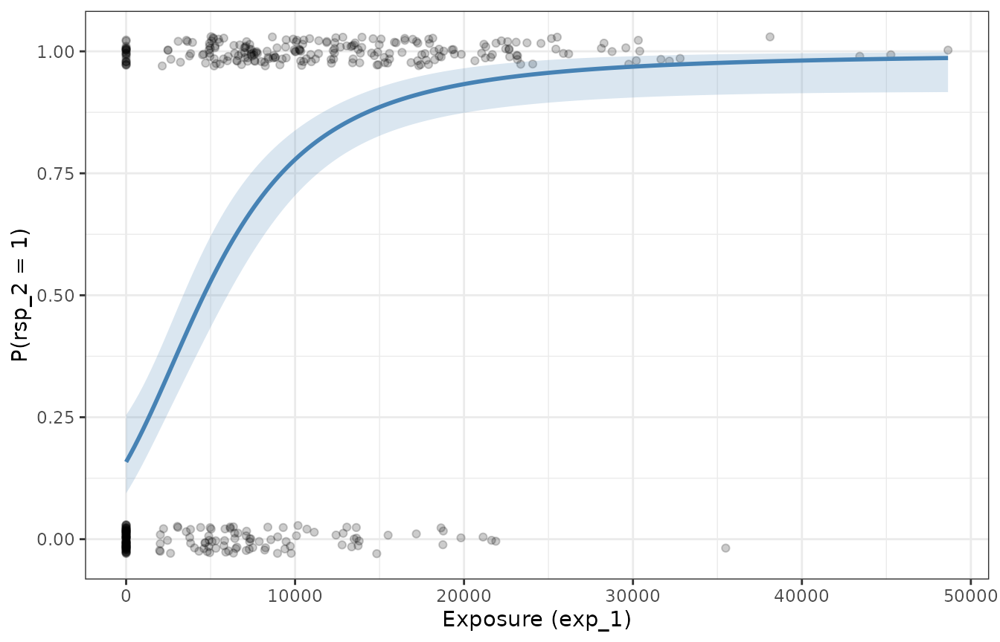

# Fitting Emax models for binary outcomes

``` r

library(emaxnls)
library(tibble)
library(ggplot2)
theme_set(theme_bw())
set.seed(123)
```

This article describes how to fit an Emax regression model to a
**binary** (0/1) outcome with
[`emax_logistic()`](https://emaxnls.djnavarro.net/reference/emax_logistic.md).
It is the companion to the article on continuous outcomes, and the
interface is deliberately parallel: you specify a `structural_model`, a
`covariate_model`, and `data` in exactly the same way. The statistical
machinery underneath is different, though, because a binary response
cannot be modelled with ordinary least squares. This article focuses on
those differences — the logit link, the Bernoulli error model, and why
estimation uses iterative reweighted least squares (IRLS) rather than a
single call to [`nls()`](https://rdrr.io/r/stats/nls.html).

If you have not already read the continuous-outcome article, it is worth
skimming first: the meaning of the structural parameters ($`E_0`$,
$`E_{\max}`$, $`EC_{50}`$, and the optional Hill coefficient) and the
way covariates enter as linear submodels are shared between the two
model types and are not repeated in full here.

## The model

### A structural model on the logit scale

For a binary outcome we model the *probability* of a positive response,
$`p = \Pr(Y = 1)`$, as a function of exposure. Probabilities are
confined to the interval $`(0, 1)`$, but the Emax structural form is
unbounded, so we do not model $`p`$ directly. Instead the Emax model is
placed on the **log-odds** (logit) scale:

``` math
\operatorname{logit}(p) = \log\!\left(\frac{p}{1 - p}\right)
  = E_0 + E_{\max}\,\frac{x}{x + EC_{50}},
```

with the sigmoidal (Hill) version

``` math
\operatorname{logit}(p) = E_0 + E_{\max}\,\frac{x^{h}}{x^{h} + EC_{50}^{\,h}}
```

available by adding a `logHill` term to the covariate model, exactly as
in the continuous case. The structural parameters have the same roles as
before, but they now live on the logit scale: $`E_0`$ is the baseline
log-odds at zero exposure, and $`E_{\max}`$ is the maximal change in
log-odds that the drug can produce. As before, $`EC_{50}`$ and the Hill
coefficient are estimated on the log scale as `logEC50` and `logHill`,
and each structural parameter can carry its own covariates.

The **logit link** is what connects this unbounded
linear-on-the-logit-scale predictor back to a probability. Writing
$`\eta`$ for the right-hand side (the *linear predictor*), the mean
response is recovered through the inverse-logit (logistic) function

``` math
p = \operatorname{logit}^{-1}(\eta) = \frac{1}{1 + e^{-\eta}},
```

which maps any real value of $`\eta`$ into $`(0, 1)`$. This guarantees
that fitted and predicted probabilities are always valid, no matter what
values the structural parameters take.

### The Bernoulli error model

Once the mean $`p_i`$ for observation $`i`$ is specified, we still need
an assumption about how the observed 0/1 outcomes scatter around it. For
binary data the natural choice is the **Bernoulli** distribution:

``` math
Y_i \sim \operatorname{Bernoulli}(p_i), \qquad
\Pr(Y_i = y_i) = p_i^{\,y_i}\,(1 - p_i)^{1 - y_i}.
```

Two consequences of this error model matter for estimation. First, the
likelihood we want to maximise is the Bernoulli (log-)likelihood

``` math
\ell(\theta) = \sum_{i=1}^{n}\Big[\, y_i \log p_i + (1 - y_i)\log(1 - p_i)\,\Big],
```

which is what
[`logLik()`](https://emaxnls.djnavarro.net/reference/logLik.md) returns
and what
[`deviance()`](https://emaxnls.djnavarro.net/reference/deviance.md)
reports as $`-2\ell(\theta)`$ (the binomial deviance). Second, the
variance of a Bernoulli observation is
$`\operatorname{Var}(Y_i) = p_i(1 - p_i)`$: it is *not constant*, but
depends on the mean. Observations with $`p_i`$ near $`0`$ or $`1`$ are
far more informative than those near $`0.5`$. This mean-variance link is
precisely what ordinary least squares ignores, and it is the reason a
bare [`nls()`](https://rdrr.io/r/stats/nls.html) fit is inappropriate
here.

## Why not a bare call to `nls()`?

It is tempting to just fit the structural Emax curve to the 0/1
responses with [`nls()`](https://rdrr.io/r/stats/nls.html), minimising
$`\sum_i (y_i - p_i)^2`$. This is a bad idea for several related
reasons:

- **The wrong error model.** Least squares is the maximum-likelihood
  estimator only under Gaussian errors with *constant* variance. Binary
  data have variance $`p_i(1 - p_i)`$, which changes with the mean.
  Treating every observation as equally precise gives statistically
  inefficient estimates and, more seriously, standard errors, confidence
  intervals, and $`p`$-values that are simply wrong.
- **Unbounded predictions.** Fitting the Emax form directly on the
  probability scale places no constraint on $`p_i`$, so nothing stops
  the fitted curve from drifting below $`0`$ or above $`1`$. The logit
  link removes this problem by construction.
- **Not the maximum-likelihood estimate.** Minimising squared error does
  not maximise the Bernoulli likelihood, so the resulting estimates lack
  the consistency and efficiency properties we rely on for inference.

The standard remedy for generalised linear models is **iterative
reweighted least squares** (IRLS), also known as Fisher scoring. The
idea is to replace the single least-squares problem with a *sequence* of
weighted least-squares problems that progressively account for the
mean-variance relationship. At each iteration, given the current linear
predictor $`\eta`$ and fitted probabilities
$`\mu = \operatorname{logit}^{-1}(\eta)`$, we form

``` math
w_i = \mu_i(1 - \mu_i)
\qquad\text{(working weights)},
\qquad
z_i = \eta_i + \frac{y_i - \mu_i}{w_i}
\qquad\text{(working response)},
```

and solve a weighted least-squares fit of the working response $`z`$ on
the structural model, using weights $`w`$. The weights are exactly the
Bernoulli variance function, so more informative observations are
up-weighted; the working response is a local linearisation of the link.
Iterating this scheme is equivalent to Fisher scoring and converges to
the maximum-likelihood estimates under the Bernoulli model.

There is one extra wrinkle specific to Emax models. In an ordinary
logistic *linear* regression each weighted step is a linear
least-squares problem. Here the structural predictor is **nonlinear** in
the parameters (exposure enters through $`x/(x + EC_{50})`$), so each
weighted step is itself a weighted *nonlinear* least squares problem.
[`emax_logistic()`](https://emaxnls.djnavarro.net/reference/emax_logistic.md)
therefore layers the IRLS loop on top of
[`nls()`](https://rdrr.io/r/stats/nls.html): the inner weighted NLS
solve reuses the same three optimisation algorithms available for
continuous models (`"gauss"`, `"port"`, `"levenberg"`), while the outer
loop updates the weights and working response. The loop is initialised
in the GLM-standard way (starting from $`\mu = (y + 1/2)/2`$ to avoid
degenerate weights at $`0`$ and $`1`$), warm-starts each NLS solve from
the previous estimates, and stops when the change in binomial deviance
falls below a tolerance. Both the tolerance and the maximum number of
outer iterations are controlled by
[`emax_logistic_options()`](https://emaxnls.djnavarro.net/reference/emax_logistic_options.md):

``` r

emax_logistic_options()
#> $optim_method
#> [1] "gauss"
#> 
#> $optim_control
#> $optim_control$maxiter
#> [1] 50
#> 
#> $optim_control$tol
#> [1] 1e-05
#> 
#> $optim_control$minFactor
#> [1] 0.0009766
#> 
#> $optim_control$printEval
#> [1] FALSE
#> 
#> $optim_control$warnOnly
#> [1] FALSE
#> 
#> $optim_control$scaleOffset
#> [1] 0
#> 
#> $optim_control$nDcentral
#> [1] FALSE
#> 
#> 
#> $quiet
#> [1] FALSE
#> 
#> $weights
#> NULL
#> 
#> $na.action
#> function (object, ...) 
#> UseMethod("na.omit")
#> <bytecode: 0x55da1daf2748>
#> <environment: namespace:stats>
#> 
#> $max_iter
#> [1] 25
#> 
#> $tol
#> [1] 1e-06
#> 
#> $max_time
#> [1] Inf
```

## The example data

We again use the bundled synthetic dataset `emax_df`, this time focusing
on the binary response `rsp_2`.

``` r

emax_df
#> # A tibble: 400 × 12
#>       id  dose  exp_1  exp_2 rsp_1 rsp_2 cnt_a cnt_b cnt_c bin_d bin_e cat_f
#>    <int> <dbl>  <dbl>  <dbl> <dbl> <dbl> <dbl> <dbl> <dbl> <dbl> <dbl> <fct>
#>  1     1   200 12332. 13004. 15.7      1  3.85  5.89  4.31     1     1 grp 1
#>  2     2   300 18232. 17244. 15.3      1  4.78  7.25  3.73     1     1 grp 1
#>  3     3     0     0      0   5.65     0  1.22  9.24  2.41     1     1 grp 1
#>  4     4   200  9394.  8839. 12.5      0  2.68  7.14  3.76     1     1 grp 2
#>  5     5   200  7088.  9827. 13.2      1  4.27  5.57  9.05     0     1 grp 2
#>  6     6   300 30402. 28483. 16.8      1  6.09  6.08  4.62     0     1 grp 1
#>  7     7   300 21679. 17137. 17.4      1  7.5   8.1   2.08     0     1 grp 3
#>  8     8   100 15506. 13377. 15.9      0  3.65  6.89  3.56     0     1 grp 1
#>  9     9     0     0      0   7.3      0  4.84  3.77  7.44     0     1 grp 2
#> 10    10   200  5331.  5251. 12.8      1  4.45  3.42  1.66     1     0 grp 3
#> # ℹ 390 more rows
```

The binary response was generated from a logit-scale Emax model with
$`E_0 = -4.5`$, $`E_{\max} = 5`$, and $`EC_{50} = 8000`$
($`\log EC_{50} \approx 8.99`$), plus genuine covariate effects of
`cnt_a` (coefficient $`0.5`$) and `bin_d` (coefficient $`1`$) on the
baseline; the remaining covariates have no effect. In other words the
data-generating linear predictor is

``` math
\operatorname{logit}(p) = -4.5 + 5\,\frac{x}{x + 8000} + 0.5\,\texttt{cnt\_a} + 1.0\,\texttt{bin\_d}.
```

Binary outcomes carry much less information per observation than
continuous ones, so we should expect the structural parameters —
especially $`E_{\max}`$ and $`EC_{50}`$ — to be estimated with
considerably more uncertainty than in the continuous article.

## Fitting the model

The call mirrors
[`emax_nls()`](https://emaxnls.djnavarro.net/reference/emax_nls.md)
exactly. We start with a deliberately simple covariate model that puts
only `cnt_a` on the baseline, and add `bin_d` later.

``` r

mod <- emax_logistic(
  structural_model = rsp_2 ~ exp_1,
  covariate_model = list(
    E0 ~ cnt_a,   # baseline log-odds depends on cnt_a
    Emax ~ 1,
    logEC50 ~ 1
  ),
  data = emax_df
)
```

As always, check convergence before interpreting anything. For an
`emaxlogistic` model this means both that the inner NLS solves succeeded
and that the outer IRLS loop reached its deviance tolerance.

``` r

emax_converged(mod)
#> [1] TRUE
```

Printing the object reports the structural and covariate models, notes
that the response is binary with a logit link, and summarises the fit
with the number of observations, the residual degrees of freedom, the
binomial deviance, and the AIC, followed by a coefficient table with
confidence intervals.

``` r

mod
#> Structural model:
#> 
#>   Exposure:       exp_1 
#>   Response:       rsp_2 
#>   Emax type:      hyperbolic 
#>   Response type:  binary (logit link)
#> 
#> Covariate model:
#> 
#>   E0:       E0 ~ cnt_a 
#>   Emax:     Emax ~ 1 
#>   logEC50:  logEC50 ~ 1 
#> 
#> Model fit:
#> 
#>   Observations:  400 
#>   Residual df:   396 
#>   Deviance:      331.5 
#>   AIC:           339.5 
#> 
#> Coefficients (95% CI):
#> 
#>   label             estimate std_error  lower  upper
#> 1 E0_cnt_a             0.659    0.0800  0.501  0.816
#> 2 E0_Intercept        -5.00     0.578  -6.14  -3.87 
#> 3 Emax_Intercept       8.12     2.27    5.08  17.6  
#> 4 logEC50_Intercept    9.78     0.518   8.89  11.0  
#> 
#> Use summary() for hypothesis tests.
```

## Interpreting the output

### Coefficients are on the logit scale

[`coef()`](https://rdrr.io/r/stats/coef.html) returns the estimates.
Because the structural model lives on the logit scale, every coefficient
is interpreted there: `E0_Intercept` is the baseline log-odds,
`E0_cnt_a` is the change in baseline log-odds per unit of `cnt_a`, and
so on.

``` r

coef(mod)
#>          E0_cnt_a      E0_Intercept    Emax_Intercept logEC50_Intercept 
#>            0.6588           -5.0004            8.1157            9.7832
```

A one-unit increase in `cnt_a` multiplies the odds of a positive
response by $`e^{0.66} \approx 1.93`$ — exponentiating a logit-scale
coefficient turns it into an **odds ratio**, the usual way to report
effects from a logistic model. As in the continuous case,
`back_transform = TRUE` exponentiates the log-scale structural
parameters (`logEC50`, and `logHill` if present), returning
`EC50`/`Hill` on their natural scales:

``` r

coef(mod, back_transform = TRUE)
#>       E0_cnt_a   E0_Intercept Emax_Intercept EC50_Intercept 
#>         0.6588        -5.0004         8.1157     17733.7869
```

The estimated baseline (`E0_Intercept` near the true $`-4.5`$) and the
`cnt_a` effect (near the true $`0.5`$) are recovered reasonably well,
whereas the structural $`E_{\max}`$ and $`EC_{50}`$ are less precisely
pinned down — a direct consequence of how little information binary
observations carry about the shape of the exposure-response curve.

### Standard errors, tests, and confidence intervals

[`summary()`](https://emaxnls.djnavarro.net/reference/summary.md) gives
the coefficient table. Note that the test statistic is a **z-statistic**
(a Wald test referred to the standard normal distribution), reflecting
the asymptotic-normal justification for inference in a
maximum-likelihood GLM, rather than the $`t`$-statistic used for
continuous models.

``` r

summary(mod)
#> # A tibble: 4 × 7
#>   label             estimate std_error z_statistic   p_value ci_lower ci_upper
#>   <chr>                <dbl>     <dbl>       <dbl>     <dbl>    <dbl>    <dbl>
#> 1 E0_cnt_a             0.659    0.0800        8.24  1.79e-16    0.501    0.816
#> 2 E0_Intercept        -5.00     0.578        -8.64  5.43e-18   -6.14    -3.87 
#> 3 Emax_Intercept       8.12     2.27          3.58  3.45e- 4    5.08    17.6  
#> 4 logEC50_Intercept    9.78     0.518        NA    NA           8.89    11.0
```

[`confint()`](https://rdrr.io/r/stats/confint.html) computes
profile-likelihood intervals from the final weighted NLS fit at
convergence. These are especially valuable here: for weakly identified
parameters such as `Emax_Intercept` and `logEC50_Intercept` the
likelihood is distinctly non-quadratic, so the profile intervals are
wide and asymmetric in a way that a symmetric Wald interval would
misrepresent.

``` r

confint(mod)
#>                      2.5%  97.5%
#> E0_cnt_a           0.5015  0.816
#> E0_Intercept      -6.1358 -3.867
#> Emax_Intercept     5.0801 17.608
#> logEC50_Intercept  8.8921 11.048
```

Note that there is no [`sigma()`](https://rdrr.io/r/stats/sigma.html)
method for a logistic model: the Bernoulli variance is fixed by the mean
through $`p(1 - p)`$, so there is no free residual standard-deviation
parameter to estimate.

### Fitted values, residuals, and predictions

[`fitted()`](https://emaxnls.djnavarro.net/reference/fitted.md) returns
fitted probabilities by default, or the linear predictor on the logit
scale with `type = "link"`:

``` r

head(fitted(mod))
#> [1] 0.70364 0.90573 0.01482 0.39544 0.53245 0.98428
head(fitted(mod, type = "link"))
#> [1]  0.8647  2.2626 -4.1967 -0.4245  0.1300  4.1373
```

Raw residuals are not very informative for binary data, so
[`residuals()`](https://emaxnls.djnavarro.net/reference/residuals.md)
returns **Pearson** residuals by default (raw residual divided by
$`\sqrt{\mu(1-\mu)}`$) and **deviance** residuals on request (whose sum
of squares equals the model deviance):

``` r

head(residuals(mod))                    # Pearson
#> [1]  0.6490  0.3226 -0.1227 -0.8088  0.9371  0.1264
head(residuals(mod, type = "deviance")) # deviance
#> [1]  0.8384  0.4450 -0.1728 -1.0033  1.1227  0.1780
```

[`predict()`](https://emaxnls.djnavarro.net/reference/predict.md)
behaves like its continuous counterpart but is link-aware. By default it
returns probabilities; with `type = "link"` it returns the linear
predictor. When an `interval` is requested, the bounds are computed on
the logit scale and then passed through the inverse-logit
transformation, so they are guaranteed to stay within $`(0, 1)`$ on the
probability scale. We use this to draw the fitted probability curve over
a grid of exposures, holding `cnt_a` at its mean:

``` r

grid <- tibble(
  exp_1 = seq(0, max(emax_df$exp_1), length.out = 200),
  cnt_a = mean(emax_df$cnt_a)
)
pred <- predict(mod, newdata = grid, interval = "confidence")
curve <- tibble(
  exp_1 = grid$exp_1,
  fit = pred[["fit"]],
  lwr = pred[["lwr"]],
  upr = pred[["upr"]]
)

ggplot(mapping = aes(exp_1)) +
  geom_jitter(
    aes(y = rsp_2),
    data = emax_df,
    height = 0.03,
    width = 0,
    alpha = 0.2
  ) +
  geom_ribbon(
    aes(ymin = lwr, ymax = upr),
    data = curve,
    fill = "steelblue",
    alpha = 0.2
  ) +
  geom_line(aes(y = fit), data = curve, colour = "steelblue", linewidth = 1) +
  labs(x = "Exposure (exp_1)", y = "P(rsp_2 = 1)")
```



The raw 0/1 outcomes are jittered vertically so they can be seen; the
solid line is the estimated probability of a positive response as a
function of exposure, and the shaded band is its pointwise confidence
band.

### Comparing models

Model comparison uses the Bernoulli likelihood.
[`AIC()`](https://emaxnls.djnavarro.net/reference/AIC.md) (and
[`BIC()`](https://rdrr.io/r/stats/AIC.html)) are built from the binomial
deviance plus a penalty per parameter, and
[`anova()`](https://emaxnls.djnavarro.net/reference/anova.md) performs a
**likelihood-ratio test**: the test statistic is the drop in deviance
between nested models, referred to a chi-squared distribution with
degrees of freedom equal to the difference in the number of parameters.

Recall that `bin_d` has a genuine effect in the data-generating model
but was omitted above. Adding it should improve the fit substantially:

``` r

mod_bin_d <- emax_logistic(
  structural_model = rsp_2 ~ exp_1,
  covariate_model = list(E0 ~ cnt_a + bin_d, Emax ~ 1, logEC50 ~ 1),
  data = emax_df
)

# information criterion: lower is better
AIC(mod, mod_bin_d)
#>           df   AIC
#> mod        4 339.5
#> mod_bin_d  5 326.0

# likelihood-ratio test for the added covariate
anova(mod, mod_bin_d)
#>      Df Deviance Df_diff  LRT Pr(>Chi)    
#> [1,]  4      331                          
#> [2,]  5      316       1 15.4  8.5e-05 ***
#> ---
#> Signif. codes:  0 '***' 0.001 '**' 0.01 '*' 0.05 '.' 0.1 ' ' 1
```

The richer model has the lower AIC and the likelihood-ratio test
strongly favours it, and the estimated `E0_bin_d` coefficient lands near
the true value of $`1`$:

``` r

coef(mod_bin_d)
#>          E0_cnt_a          E0_bin_d      E0_Intercept    Emax_Intercept 
#>            0.6926            1.1114           -5.6865            7.9922 
#> logEC50_Intercept 
#>            9.7520
```

## Where to go next

The remaining tools work for `emaxlogistic` objects just as they do for
continuous models:

- **Covariate selection.**
  [`emax_scm_forward()`](https://emaxnls.djnavarro.net/reference/emax_scm.md)
  and
  [`emax_scm_backward()`](https://emaxnls.djnavarro.net/reference/emax_scm.md)
  run stepwise selection using the same p-value criterion, and
  [`emax_scm_history()`](https://emaxnls.djnavarro.net/reference/emax_scm.md)
  records every model tried.
- **Simulation.** The
  [`simulate()`](https://emaxnls.djnavarro.net/reference/simulate.md)
  method draws parameter values from their estimated distribution,
  computes the implied probabilities, and then draws fresh Bernoulli
  outcomes — useful for predictive checks and simulation-based
  intervals.
- **Continuous outcomes.** For a continuous response, use
  [`emax_nls()`](https://emaxnls.djnavarro.net/reference/emax_nls.md),
  described in its own article.
