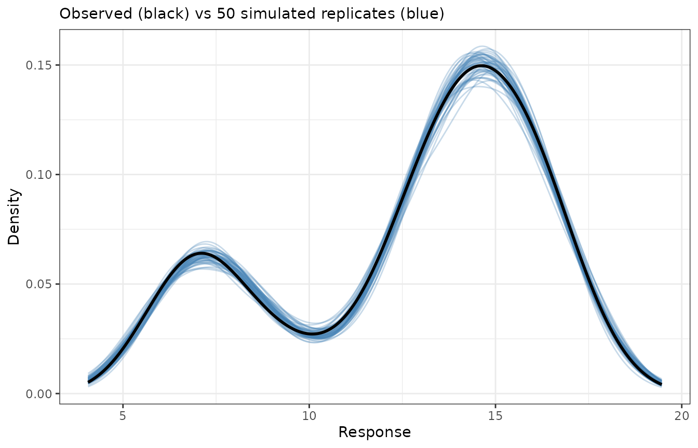
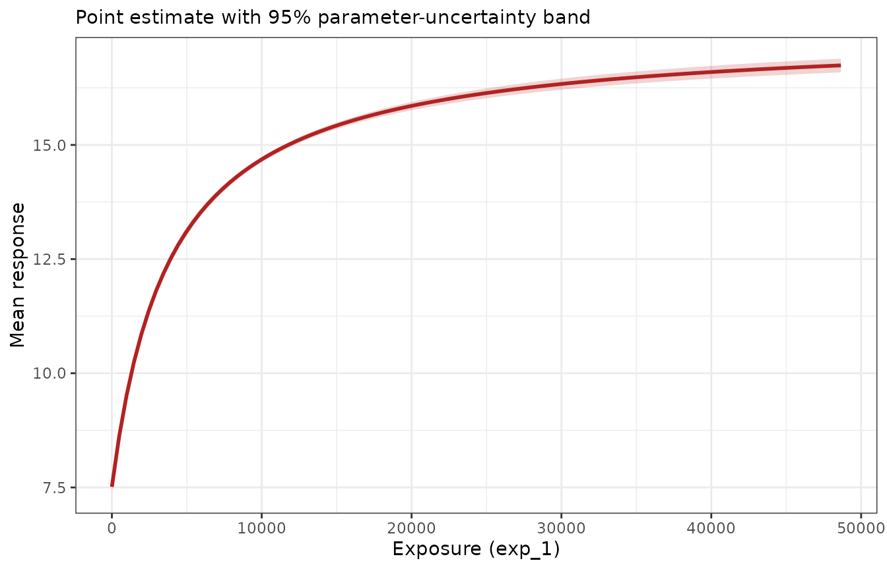

# Simulating from Emax models

``` r

library(emaxnls)
library(tibble)
library(ggplot2)
theme_set(theme_bw())
set.seed(123)
```

Once a model has been fitted, it is often useful to generate *new* data
from it: for predictive checks, for simulation-based intervals, or as
the input to some downstream analysis. The package offers two tools for
this, operating at different levels:

- **[`simulate()`](https://emaxnls.djnavarro.net/reference/simulate.md)**
  is the high-level method. It generates complete replicate datasets
  from a fitted model, automatically propagating the uncertainty in the
  parameter estimates as well as the observation-level noise.
- **[`emax_fun()`](https://emaxnls.djnavarro.net/reference/emax_fun.md)**
  is the low-level building block. It extracts the deterministic Emax
  prediction function from a fitted model, letting you evaluate the
  curve at any parameter values and any data you choose — the raw
  material for building custom simulations by hand.

This article focuses on continuous outcomes fitted with
[`emax_nls()`](https://emaxnls.djnavarro.net/reference/emax_nls.md) and
then shows that both tools work identically for binary outcomes fitted
with
[`emax_logistic()`](https://emaxnls.djnavarro.net/reference/emax_logistic.md).
Both rely on the **mvtnorm** package for drawing parameter values, so it
needs to be installed.

We use a fitted continuous model throughout:

``` r

mod <- emax_nls(
  structural_model = rsp_1 ~ exp_1,
  covariate_model = list(E0 ~ cnt_a, Emax ~ 1, logEC50 ~ 1),
  data = emax_df
)
```

## The `simulate()` method

Calling
[`simulate()`](https://emaxnls.djnavarro.net/reference/simulate.md)
generates one or more replicate datasets. The number of replicates is
set by `nsim`, and a `seed` can be supplied for reproducibility:

``` r

sim1 <- simulate(mod, nsim = 1, seed = 1)
sim1
#> # A tibble: 400 × 11
#>    dat_id sim_id    mu   val E0_cnt_a E0_Intercept Emax_Intercept
#>     <int>  <int> <dbl> <dbl>    <dbl>        <dbl>          <dbl>
#>  1      1      1 14.4  14.6     0.487         5.10           9.91
#>  2      2      1 15.5  15.1     0.487         5.10           9.91
#>  3      3      1  5.69  5.94    0.487         5.10           9.91
#>  4      4      1 13.3  13.7     0.487         5.10           9.91
#>  5      5      1 13.5  13.8     0.487         5.10           9.91
#>  6      6      1 16.8  16.7     0.487         5.10           9.91
#>  7      7      1 17.1  17.9     0.487         5.10           9.91
#>  8      8      1 14.7  14.9     0.487         5.10           9.91
#>  9      9      1  7.45  7.14    0.487         5.10           9.91
#> 10     10      1 12.9  11.8     0.487         5.10           9.91
#> # ℹ 390 more rows
#> # ℹ 4 more variables: logEC50_Intercept <dbl>, rsp_1 <dbl>, exp_1 <dbl>,
#> #   cnt_a <dbl>
```

### What `simulate()` actually does

Generating a replicate involves two distinct sources of randomness, and
[`simulate()`](https://emaxnls.djnavarro.net/reference/simulate.md)
accounts for both:

1.  **Parameter uncertainty.** A fresh parameter vector is drawn from
    the multivariate normal distribution implied by the estimates and
    their covariance matrix, i.e. from
    $`\mathcal{N}(\hat\theta, \widehat{\operatorname{Var}}(\hat\theta))`$
    using `coef(mod)` and `vcov(mod)`. This represents how uncertain we
    are about the fitted parameters themselves.
2.  **Observation noise.** Given that parameter draw, the Emax mean
    $`\mu_i`$ is evaluated at each observation’s exposure and
    covariates, and a response is generated around it. For a continuous
    model this adds Gaussian residual noise,
    $`\text{val}_i = \mu_i + \varepsilon_i`$ with
    $`\varepsilon_i \sim \mathcal{N}(0, \hat\sigma^2)`$.

Because both sources are included, the simulated `val` column behaves
like a genuine new dataset drawn from the fitted model, not merely a
noiseless prediction. (This is what distinguishes
[`simulate()`](https://emaxnls.djnavarro.net/reference/simulate.md) from
`predict(..., interval = "prediction")`, which reports an analytic
interval for the mean rather than generating replicate datasets you can
analyse downstream.)

### The output format

The result is a tidy, long-format tibble with `nsim`$`\times`$`nobs`
rows. For a single replicate that is one row per observation:

``` r

names(sim1)
#>  [1] "dat_id"            "sim_id"            "mu"               
#>  [4] "val"               "E0_cnt_a"          "E0_Intercept"     
#>  [7] "Emax_Intercept"    "logEC50_Intercept" "rsp_1"            
#> [10] "exp_1"             "cnt_a"
```

The columns are:

- `dat_id` — an index identifying the original observation (row of the
  data).
- `sim_id` — which replicate the row belongs to (`1` to `nsim`).
- `mu` — the Emax mean for that observation under the sampled
  parameters.
- `val` — the simulated response (the mean plus residual noise).
- the sampled parameter values (`E0_cnt_a`, `E0_Intercept`, …), repeated
  across all rows of a replicate — one parameter draw is used per
  replicate.
- the original data variables used by the model (`rsp_1`, `exp_1`,
  `cnt_a`), carried along so you can group or plot by exposure and
  covariates.

Requesting several replicates stacks them, and the sampled parameters
vary from one replicate to the next while staying constant within a
replicate:

``` r

sims <- simulate(mod, nsim = 50, seed = 1)
dim(sims)
#> [1] 20000    11

# one parameter draw per replicate
unique(sims[sims$sim_id <= 3, c("sim_id", "E0_Intercept", "Emax_Intercept")])
#> # A tibble: 3 × 3
#>   sim_id E0_Intercept Emax_Intercept
#>    <int>        <dbl>          <dbl>
#> 1      1         5.10           9.91
#> 2      2         4.99          10.1 
#> 3      3         5.01          10.1
```

### A predictive check

A natural use of these replicates is a *predictive check*: if the model
is adequate, the distribution of simulated responses should resemble the
distribution of the observed response. Overlaying the density of the
observed `rsp_1` on the densities of several simulated replicates gives
a quick visual check:

``` r

ggplot(sims, aes(val, group = sim_id)) +
  geom_line(stat = "density", colour = "steelblue", alpha = 0.3) +
  geom_line(
    aes(rsp_1),
    data = emax_df,
    stat = "density",
    inherit.aes = FALSE,
    colour = "black",
    linewidth = 1
  ) +
  labs(
    x = "Response",
    y = "Density",
    subtitle = "Observed (black) vs 50 simulated replicates (blue)"
  )
```



The observed distribution sits comfortably within the spread of the
simulated replicates, which is what we would hope to see from a
well-fitting model.

## The `emax_fun()` tool

Where
[`simulate()`](https://emaxnls.djnavarro.net/reference/simulate.md)
bundles parameter sampling and noise generation together,
[`emax_fun()`](https://emaxnls.djnavarro.net/reference/emax_fun.md)
exposes the deterministic core: the Emax prediction function itself. It
returns a function of two arguments, `param` and `data`, both of which
default to the values used when the model was fitted.

``` r

f <- emax_fun(mod)

# with no arguments, it reproduces the fitted values
head(f())
#> [1] 14.501 15.591  5.648 13.402 13.562 16.852
head(fitted(mod))
#> [1] 14.501 15.591  5.648 13.402 13.562 16.852
```

Because you control both arguments, you can evaluate the model in
situations the original fit never saw. Supplying `param` lets you ask
counterfactual “what if the parameters were different?” questions — for
example, setting the baseline intercept to zero:

``` r

alt <- coef(mod)
alt["E0_Intercept"] <- 0
head(f(param = alt))
#> [1]  9.4458 10.5365  0.5931  8.3477  8.5067 11.7967
```

Supplying `data` lets you evaluate the curve at exposures and covariate
values of your choosing — for instance, tracing the dose-response
relationship over a grid of exposures while holding a covariate fixed:

``` r

grid <- tibble(exp_1 = c(0, 1000, 4000, 8000, 20000), cnt_a = 5)
f(data = grid)
#> [1]  7.486  9.520 12.533 14.188 15.828
```

For an `emaxnls` model the returned values are on the response scale.
(For an `emaxlogistic` model,
[`emax_fun()`](https://emaxnls.djnavarro.net/reference/emax_fun.md)
applies the inverse-logit transform so the values are probabilities —
see below.)

### Building a custom simulation

[`emax_fun()`](https://emaxnls.djnavarro.net/reference/emax_fun.md) is
the tool to reach for when
[`simulate()`](https://emaxnls.djnavarro.net/reference/simulate.md) does
not do exactly what you need and you want to assemble the pieces
yourself. As an illustration, we can build a dose-response curve with a
parameter-uncertainty band by combining
[`emax_fun()`](https://emaxnls.djnavarro.net/reference/emax_fun.md) with
a manual parameter draw — reproducing, at a lower level, the
parameter-sampling step that
[`simulate()`](https://emaxnls.djnavarro.net/reference/simulate.md)
performs internally.

The recipe is: draw many parameter vectors from the estimated sampling
distribution, evaluate the curve over an exposure grid for each draw,
and summarise the resulting family of curves pointwise.

``` r

set.seed(1)
n_draws <- 500
draws <- mvtnorm::rmvnorm(n_draws, mean = coef(mod), sigma = vcov(mod))
colnames(draws) <- names(coef(mod))

# exposure grid at an average covariate value
curve_grid <- tibble(
  exp_1 = seq(0, max(emax_df$exp_1), length.out = 100),
  cnt_a = mean(emax_df$cnt_a)
)

# evaluate the Emax curve for every parameter draw
curves <- apply(draws, 1, function(p) f(data = curve_grid, param = p))

# summarise pointwise across draws
band <- tibble(
  exp_1 = curve_grid$exp_1,
  fit = f(data = curve_grid),
  lwr = apply(curves, 1, stats::quantile, probs = 0.025),
  upr = apply(curves, 1, stats::quantile, probs = 0.975)
)

ggplot(band, aes(exp_1)) +
  geom_ribbon(aes(ymin = lwr, ymax = upr), fill = "firebrick", alpha = 0.2) +
  geom_line(aes(y = fit), colour = "firebrick", linewidth = 1) +
  labs(x = "Exposure (exp_1)", y = "Mean response", subtitle = "Point estimate with 95% parameter-uncertainty band")
```



Note that this band reflects *only* parameter uncertainty, because we
summarised the mean curve `mu` and never added residual noise — it is
the analogue of a confidence band. Adding a step that draws
`rnorm(..., sd = sigma(mod))` around each evaluated mean would turn it
into a prediction band that also captures observation noise, which is
precisely the extra ingredient
[`simulate()`](https://emaxnls.djnavarro.net/reference/simulate.md)
supplies for you. This is the essential trade-off between the two tools:
[`simulate()`](https://emaxnls.djnavarro.net/reference/simulate.md) is
convenient and complete, while
[`emax_fun()`](https://emaxnls.djnavarro.net/reference/emax_fun.md) is
transparent and fully under your control.

## The same tools for binary outcomes

Both tools work unchanged for `emaxlogistic` models; only the scales
differ.

``` r

mod_b <- emax_logistic(
  structural_model = rsp_2 ~ exp_1,
  covariate_model = list(E0 ~ cnt_a, Emax ~ 1, logEC50 ~ 1),
  data = emax_df
)
```

For [`simulate()`](https://emaxnls.djnavarro.net/reference/simulate.md),
the `mu` column holds the fitted *probability* for each observation
under the sampled parameters, and `val` is a 0/1 outcome drawn from
$`\text{Bernoulli}(\mu)`$ rather than a mean plus Gaussian noise:

``` r

sim_b <- simulate(mod_b, nsim = 2, seed = 1)
head(sim_b)
#> # A tibble: 6 × 11
#>   dat_id sim_id     mu   val E0_cnt_a E0_Intercept Emax_Intercept
#>    <int>  <int>  <dbl> <dbl>    <dbl>        <dbl>          <dbl>
#> 1      1      1 0.632      0    0.623        -4.61           6.93
#> 2      2      1 0.857      0    0.623        -4.61           6.93
#> 3      3      1 0.0209     0    0.623        -4.61           6.93
#> 4      4      1 0.349      0    0.623        -4.61           6.93
#> 5      5      1 0.489      0    0.623        -4.61           6.93
#> 6      6      1 0.970      1    0.623        -4.61           6.93
#> # ℹ 4 more variables: logEC50_Intercept <dbl>, rsp_2 <dbl>, exp_1 <dbl>,
#> #   cnt_a <dbl>

# simulated responses are binary
sort(unique(sim_b$val))
#> [1] 0 1
```

For [`emax_fun()`](https://emaxnls.djnavarro.net/reference/emax_fun.md),
the returned function gives predicted probabilities directly (the
inverse-logit transform is applied internally), so its values always lie
in $`(0, 1)`$:

``` r

f_b <- emax_fun(mod_b)
range(f_b())
#> [1] 0.009901 0.997947
```

Everything else — custom parameter values, custom data grids, and
building your own simulations on top of the prediction function —
carries over exactly as in the continuous case.

## Notes

- Both
  [`simulate()`](https://emaxnls.djnavarro.net/reference/simulate.md)
  and
  [`emax_fun()`](https://emaxnls.djnavarro.net/reference/emax_fun.md)’s
  uncertainty workflows draw parameters with **mvtnorm**, which must be
  installed;
  [`simulate()`](https://emaxnls.djnavarro.net/reference/simulate.md)
  errors informatively if it is missing.
- [`simulate()`](https://emaxnls.djnavarro.net/reference/simulate.md)
  captures two sources of variability (parameter uncertainty and
  observation noise); a band built from
  [`emax_fun()`](https://emaxnls.djnavarro.net/reference/emax_fun.md)
  captures only whatever you choose to include, so decide deliberately
  whether you want a confidence-style band (means only) or a
  prediction-style band (means plus residual noise).
- For a quick analytic interval on the mean or a single new observation,
  prefer `predict(..., interval = ...)`, described in the model-fitting
  articles. Reach for
  [`simulate()`](https://emaxnls.djnavarro.net/reference/simulate.md)
  and
  [`emax_fun()`](https://emaxnls.djnavarro.net/reference/emax_fun.md)
  when you need replicate datasets or bespoke simulation logic.
